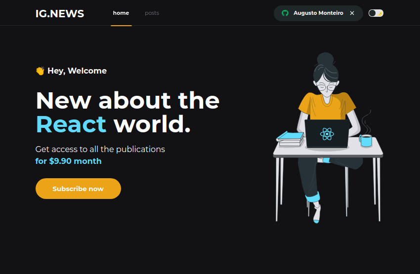
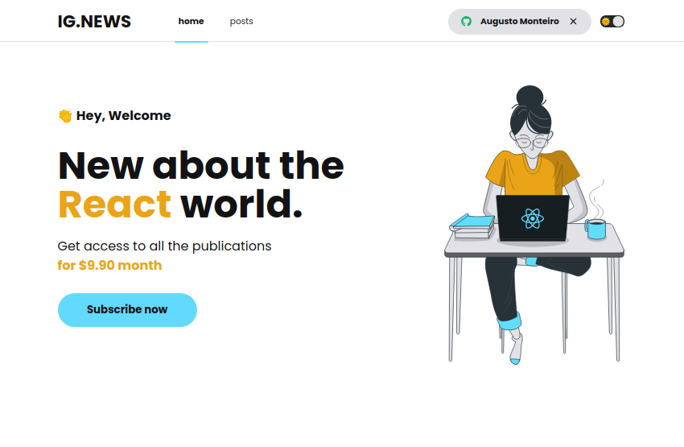
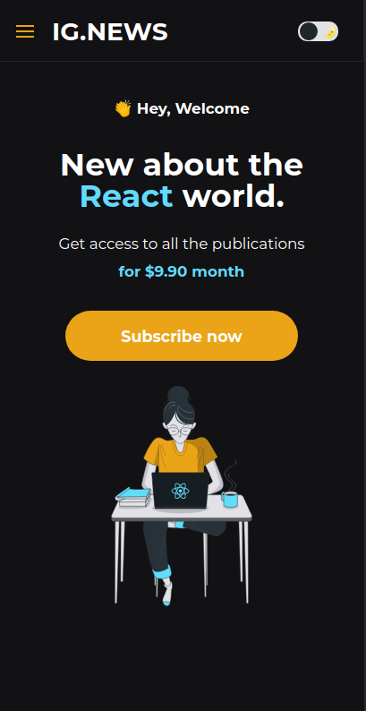
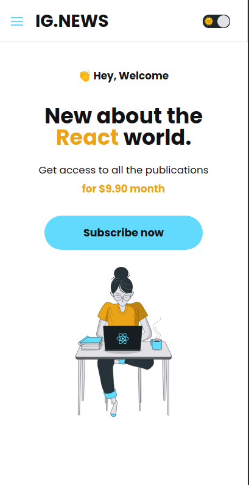
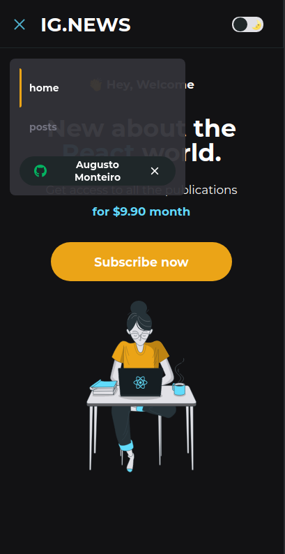
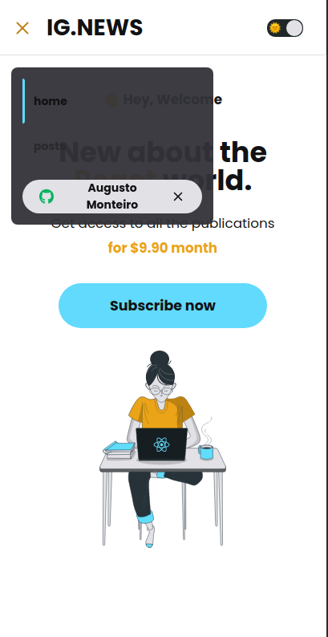

# AppIgNews

    
  

## Tópicos

[Sobre o AppMovies](#sobre-o-appignews)

[Tecnologias](#tecnologias)

[Licença](#licença)

 

## Sobre o AppIgNews

O App Ig.News é um App que criado com a finalidade de gerenciar conteúdo. Desenvolvido na trilha ignite [Rocketseat](https://rocketseat.com.br/).

 

## Dark Mode Desktop

  
   

## Light Mode

  
   

## Dark|Light Mode Mobile

  
   
   
  
   
   

 

## Tecnologias

Tecnologias e ferramentas utilizadas no desenvolvimento do projeto:

- [NestJS](https://nextjs.org/)
- [TypeScript](https://www.typescriptlang.org/)
- [axios](https://github.com/axios/axios)
- [styled-component](https://styled-components.com/)
- [polished](https://polished.js.org/)
- [Prismic Client](https://prismic.io/docs/technical-reference/prismicio-client)
- [stripe.js](https://stripe.com/docs/js)
- [faunadb](https://fauna.com/)
- [prismic dom](https://prismic.io/docs/technologies/prismic-dom-technical-reference)
- [react-icons](https://react-icons.github.io/react-icons/)
- [react-loading](https://github.com/fakiolinho/react-loading)
- [stripe](https://stripe.com/br)
- [VS Code](https://code.visualstudio.com/) com [ESLint](https://eslint.org/), [Prettier](https://prettier.io/) e [EditorConfig](https://editorconfig.org/)

 

## Licença

 

Esse projeto está sob a licença MIT. Veja o arquivo [LICENSE](/LICENSE) para mais detalhes.

---

Feito com :purple_heart: by [Augusto Monteiro](https://github.com/augustojaml)

